<div align="center">
  
  <h1>JlocalMusic 音乐播放器</h1>
</div>

[](https://opensource.org/licenses/MIT)
[](https://tauri.app)
[](https://react.dev)

<div align="right">
  <a href="README.md">🇬🇧 English</a>
</div>

一个基于 Tauri 2 + React 19 的本地音乐播放器，专注于简洁、高效的本地音乐管理体验。

<div align="center">
  <table>
    <tr>
      <td>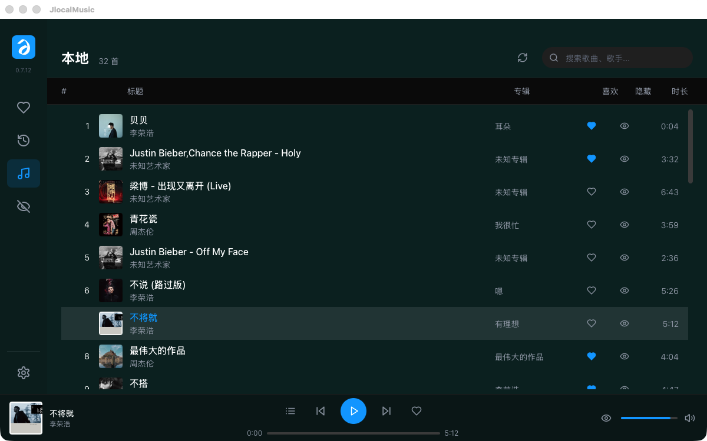</td>
      <td>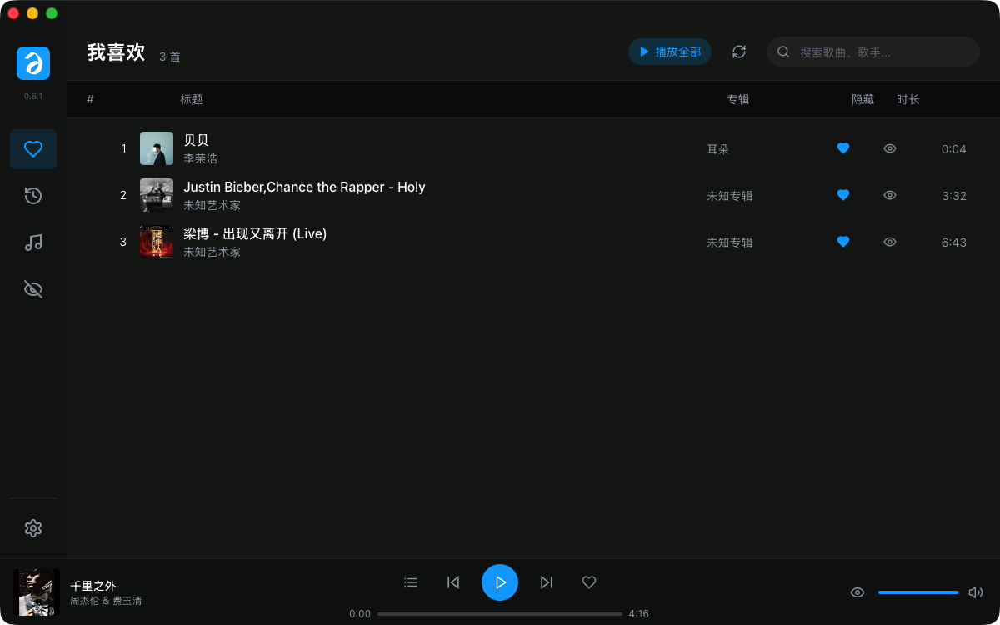</td>
      <td>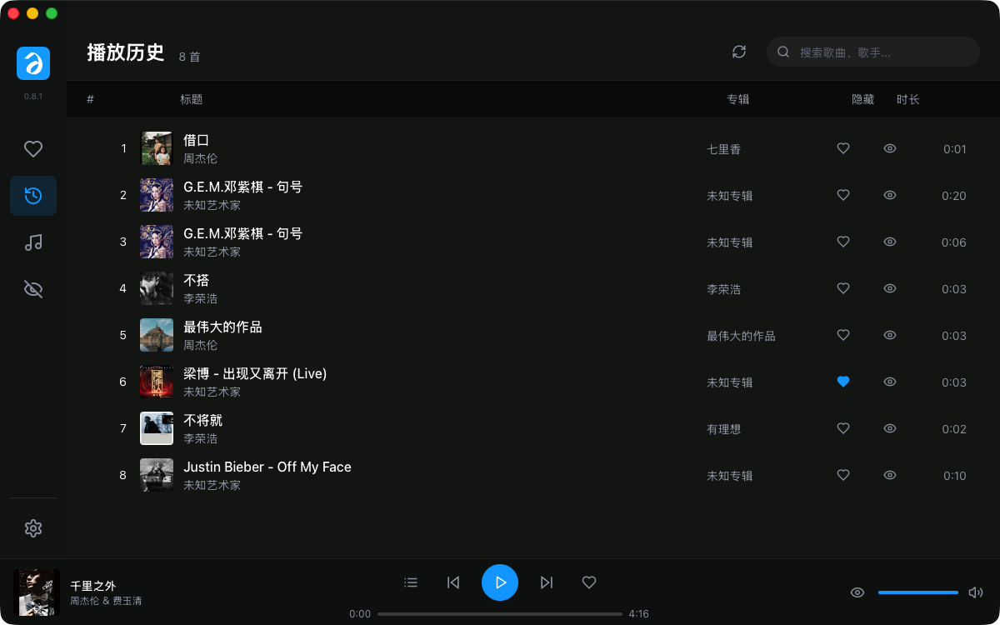</td>
    </tr>
    <tr>
      <td align="center"><b>🎵 本地音乐</b></td>
      <td align="center"><b>❤️ 我喜欢</b></td>
      <td align="center"><b>📋 播放历史</b></td>
    </tr>
    <tr>
      <td>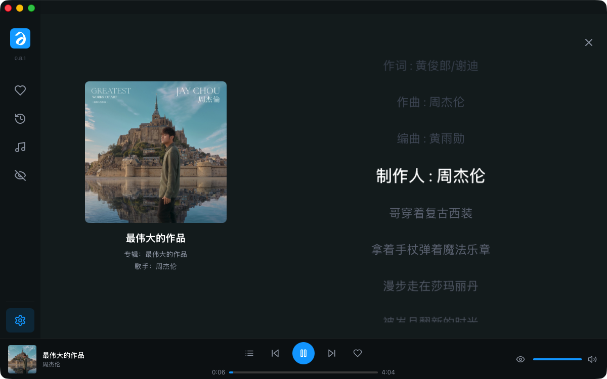</td>
      <td>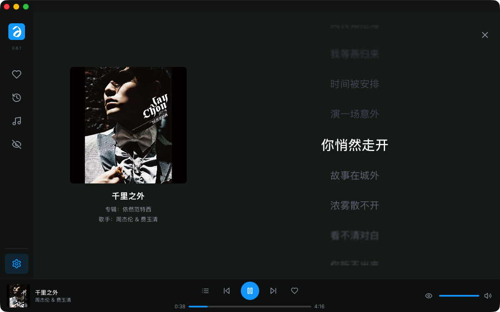</td>
      <td>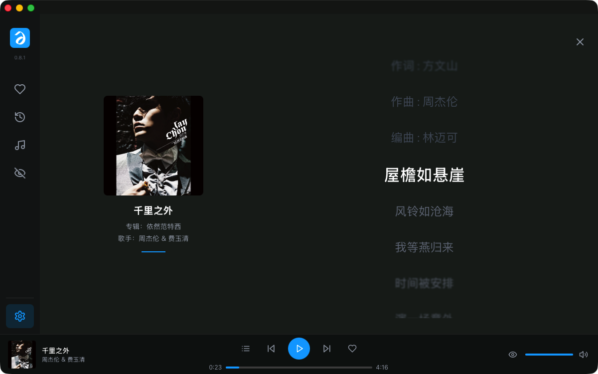</td>
    </tr>
    <tr>
      <td align="center"><b>🎤 歌词界面</b></td>
      <td align="center"><b>▶️ 歌曲播放</b></td>
      <td align="center"><b>⏸️ 歌曲暂停</b></td>
    </tr>
    <tr>
      <td>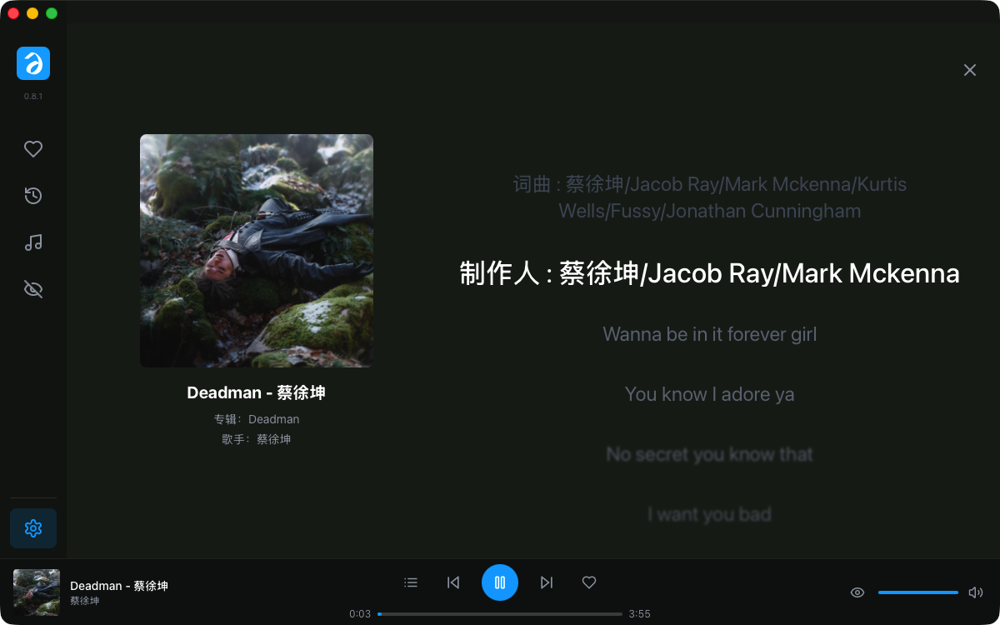</td>
      <td>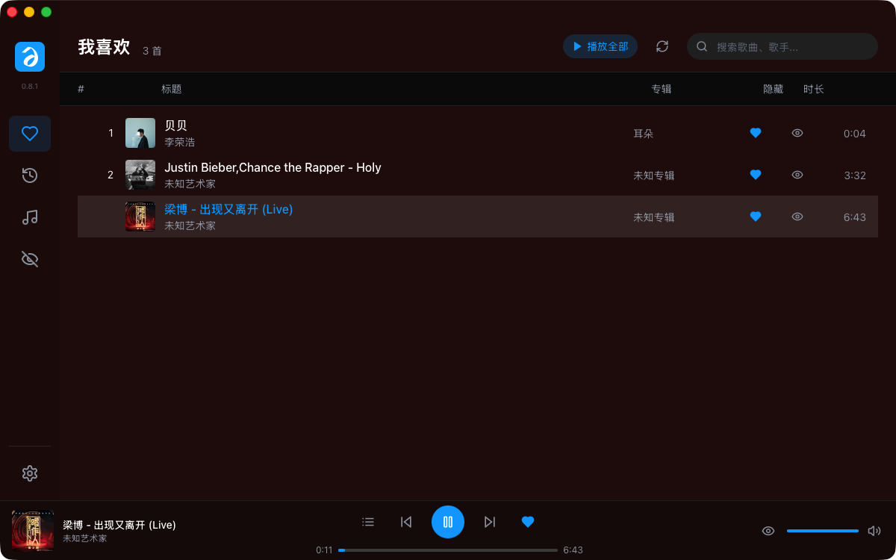</td>
      <td>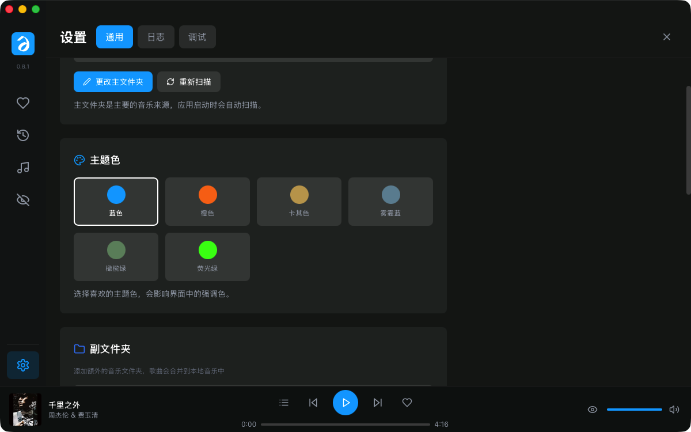</td>
    </tr>
    <tr>
      <td align="center"><b>🎨 专辑封面改变背景颜色</b></td>
      <td align="center"><b>🌈 不同颜色专辑的效果</b></td>
      <td align="center"><b>⚙️ 设置</b></td>
    </tr>
    <tr>
      <td>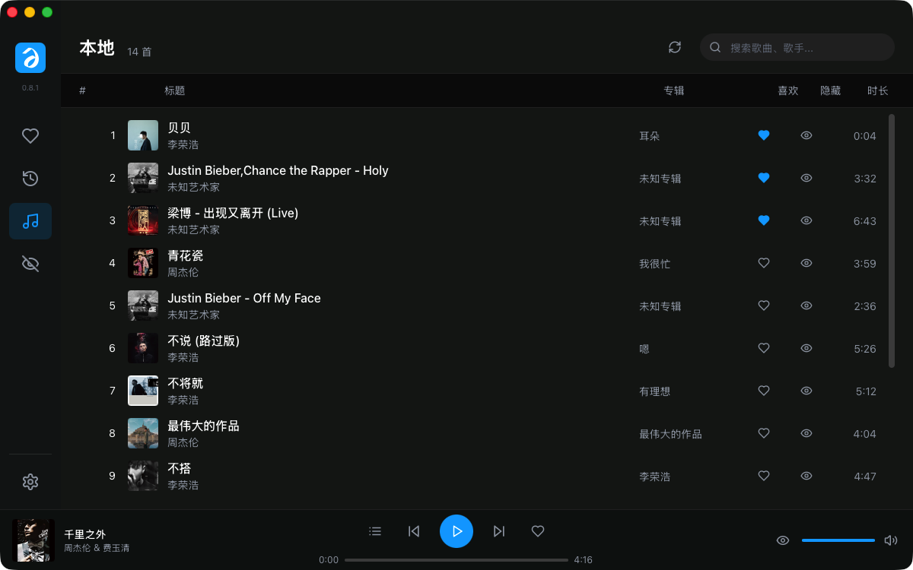</td>
      <td>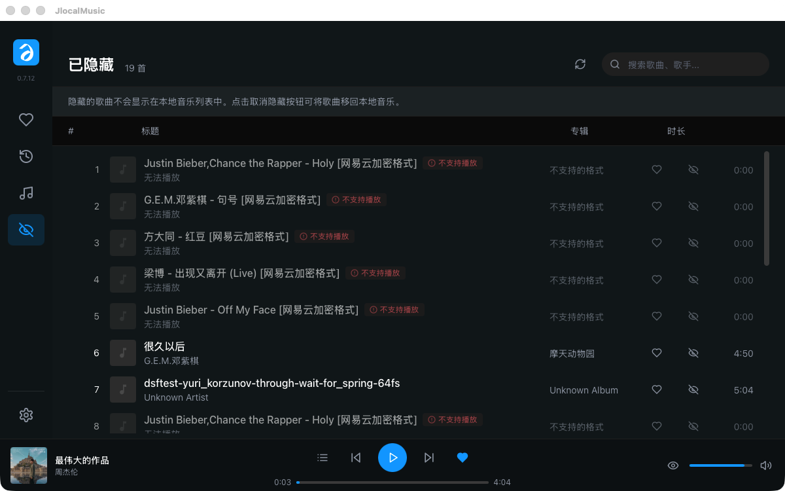</td>
      <td></td>
    </tr>
    <tr>
      <td align="center"><b>📁 本地歌单</b></td>
      <td align="center"><b>🙈 隐藏歌曲</b></td>
      <td></td>
    </tr>
  </table>
</div>

## ✨ 特性

- 🚀 **轻量快速** - 基于 Tauri 2，包体积小，启动速度快
- 🎵 **格式丰富** - 支持 MP3、FLAC、WAV、DSF、DFF、OGG、AAC、M4A 等主流格式
- 🎤 **歌词支持** - 支持 LRC 歌词文件和内嵌歌词，自动同步滚动
- 🎨 **主题系统** - 5 种主题（蓝色/橙色/卡其/雾霾蓝/橄榄绿/荧光绿），动态背景色
- 🔒 **本地优先** - 所有数据存储在本地，保护隐私
- 📁 **智能管理** - 多文件夹支持，自动清理已删除歌曲
- ▶️ **独立播放队列** - 每个视图（本地/我喜欢/已隐藏/历史）维护自己的播放队列

## 🖱️ 交互操作

- 🖱️ **滚轮调节进度** - 鼠标悬停在进度条上，滚动滚轮即可快进/快退
- 🔊 **滚轮调节音量** - 鼠标悬停在音量条附近，滚动滚轮即可调节音量
- 🎤 **点击专辑播放/暂停** - 在歌词界面点击专辑封面即可切换播放/暂停
- 🔄 **小图标切换歌词** - 点击左下角小专辑图标可进入或退出歌词界面
- 👁️ **悬停显示歌词** - 鼠标在歌词界面悬停时，全部歌词清晰显示
- ✋ **拖动歌词定位** - 可拖动歌词到具体位置，从该歌词处开始播放

## 🛠️ 技术栈

## 🎼 支持格式

| 格式 | 扩展名 | 状态 |
|------|--------|------|
| MP3 | .mp3 | ✅ 完整支持 |
| FLAC | .flac | ✅ 完整支持 |
| WAV | .wav | ✅ 完整支持 |
| DSF/DSD | .dsf, .dff, .dsd | ✅ 完整支持 |
| OGG Vorbis | .ogg, .oga | ✅ 完整支持 |
| AAC/M4A | .aac, .m4a | ✅ 完整支持 |
| NCM | .ncm | ⚠️ 仅识别，自动隐藏 |
| QMC | .qmc, .qmc0, .qmc3 | ⚠️ 仅识别，自动隐藏 |

> 💡 目前主要在 macOS Apple Silicon 平台开发测试，Windows/Linux 未来有望支持。

## 🛠️ 技术栈

本项目使用以下开源库：

### 前端
- [React](https://react.dev) - UI 框架 (MIT)
- [TypeScript](https://www.typescriptlang.org) - 编程语言 (Apache 2.0)
- [Tailwind CSS](https://tailwindcss.com) - CSS 框架 (MIT)
- [Zustand](https://zustand-demo.pmnd.rs) - 状态管理 (MIT)
- [Lucide React](https://lucide.dev) - 图标库 (ISC)
- [Vite](https://vitejs.dev) - 构建工具 (MIT)
- [Vitest](https://vitest.dev) - 测试框架 (MIT)
- [sonner](https://sonner.emilkowal.ski/) - 通知组件 (MIT)
- [colorthief](https://lokeshdhakar.com/projects/color-thief/) - 专辑封面颜色提取 (MIT)
- [react-hotkeys-hook](https://github.com/JohannesKlauss/react-hotkeys-hook) - 键盘快捷键 (MIT)
- [es-toolkit](https://es-toolkit.slash.page/) - 防抖/节流工具 (MIT)

### 后端
- [Tauri](https://tauri.app) - 桌面应用框架 (MIT/APACHE-2.0)
- [Rust](https://www.rust-lang.org) - 编程语言 (MIT/APACHE-2.0)
- [rodio](https://docs.rs/rodio/) - 音频播放 (MIT)
- [Symphonia](https://github.com/pcherten/Symphonia) - 音频解码 (MPL 2.0)
- [lofty](https://docs.rs/lofty/) - 音频元数据 (MIT)
- [sqlx](https://github.com/launchbadge/sqlx) - 数据库 (MIT/APACHE-2.0)
- [tokio](https://tokio.rs) - 异步运行时 (MIT)
- [chardetng](https://docs.rs/chardetng) - 编码自动检测 (MIT/APACHE-2.0)

## 🚀 开发

### 前置要求
- Node.js 18+
- Rust 1.70+
- macOS (Apple Silicon)

### 本地运行

```bash
# 克隆仓库
git clone https://github.com/your-username/jlocal.git
cd jlocal

# 安装依赖
npm install

# 开发模式
npm run tauri:dev

# 构建
npm run tauri:build
```

### 常用命令

```bash
npm run dev          # 前端开发
npm run typecheck    # 类型检查
npm test            # 运行测试
npm run lint        # 代码检查
```

## 📝 版本历史

### v0.8.2 (2026-05-10)
> 🔥 音频引擎重写 — 修复首次播放无声音 + 窗口拖拽

- 🔊 **首次播放无声修复** — SineWave 预热 CoreAudio 管线，永久 Sink 保持全生命周期连接不断开
- 🖱️ **窗口拖拽修复** — 三层保障：`data-tauri-drag-region` + CSS `-webkit-app-region: drag` + inline 样式；移除侧边栏冲突

### v0.8.1 (2026-05-10)
> 🎨 macOS 深色标题栏 + 版本号修复 + 前后端连接优化

- 🖤 **macOS 深色标题栏** — Overlay 透明标题栏模式，标题栏区域融入深色背景
- 🖱️ **窗口拖拽修复** — 顶部区域（边栏/主内容区）支持拖拽移动窗口
- 🔗 **前后端连接优化** — `get_audio_file` 移入 `spawn_blocking` + 50MB 大小限制
- 🚀 **批量封面并发** — `get_song_covers_batch` 20 个并发处理替代串行
- 🔢 **版本号统一** — 修复 APP_CONFIG 版本号未同步问题（0.7.12 → 0.8.1）

### v0.8.0 (2026-05-10)
> 🎨 全新 Logo + 稳定性大修 — 10 项稳定性修复 + 新 Logo + 荧光绿主题

- 🎨 **全新 Logo** — 替换为更简洁现代的新 Logo 设计
- 🟢 **荧光绿主题** — 新增荧光绿 (`#39FF14`) 主题色
- 🛡️ **OutputStream 恢复** — 音频设备失效后自动重试重建，无需重启应用
- ⚡ **阻塞 IO 隔离** — 扫描器/元数据提取移入 `spawn_blocking`，大库扫描不再卡 UI
- 🎯 **竞态防护** — 播放操作引入序列号机制，快速切歌不再状态混乱
- 🎚️ **播放完成检测** — 改用 `sink.empty()` 替代时间估算，切歌更精准
- 🔀 **Shuffle 重构** — Fisher-Yates 预洗牌替代运行时随机选取，保证不重复
- 🗄️ **数据库优化** — `cleanup_nonexistent_songs` 分批事务 + 只查 path 字段
- 🔇 **解码容错** — flac_decoder 连续错误限制 + 日志记录，损坏文件不再静默跳过
- 🧹 **HMR 兼容** — playerStore 增加 `destroy()` 方法，React 严格模式/HMR 不再残留
- 🖼️ **截图更新** — 7 张新版界面截图替换旧截图
- 📘 **README 增强** — 新增「交互操作」章节，文档包含完整界面截图

### v0.7.12 + patch (2026-05-10)
> 🔥 代码审查修复版本 — 修复 15 个问题（3 严重 + 6 重要 + 6 代码质量）+ 7 个发布后修复

**v0.7.12（原始版本）**
- 🐛 **SongListHeader 表头可见** — 移除 `hidden` 类，列标签正常显示
- 🐛 **播放历史修复** — `finalizePlayHistory` 正确 await，切歌不再丢失历史
- 🛡️ **CSP 安全策略** — 从 null 改为限制性安全策略
- 🎨 **专辑色提取** — colorthief Median Cut 算法替代单像素采样
- ⚡ **批量封面请求** — `useSongCovers` 使用单次 RPC 替代 N 次顺序请求
- 📦 **类型去重** — `ViewType`/`PlayMode` 统一在 `types.ts` 定义
- ⚙️ **配置去重** — `PLAYER_CONFIG` 合并到 `APP_CONFIG`，`progressInterval` 值不一致修复
- 🪟 **窗口可调整大小** — 最小 900×600，不再固定 1200×750
- 🔧 **Rust 路径验证去重** — `settings.rs` 中重复函数删除
- 🧹 **清理未使用依赖** — 前端 `clsx`/`tailwind-merge`，Rust `config`/`regex`
- 🔧 **类型转换 hack 修复** — `SortableItem` 接口添加 `path` 字段
- 🔁 **HistoryView 引用稳定** — `loadPlayHistory` 用 `useCallback` 包装
- ⏱️ **音量防抖** — 100ms 防抖减少后端频繁调用
- 🚀 **getLikedSongs SQL JOIN** — 后端 JOIN 查询替代客户端过滤
- 🗑️ **批量取消喜欢** — `clear_liked_songs` RPC 取消循环逐个操作

**v0.7.12-patch（发布后修复）**
- 🐛 **Windows 构建** — `lto = true` → `lto = "thin"` 修复 MSVC 链接器兼容性
- 🐛 **播放器 sink 生命周期** — `sink.take()` 现在正确停止 sink 并清理状态
- 🐛 **`get_song_play_count` 类型修复** — `fetch_optional` + `?` 替代错误的 `unwrap_or(0)`
- 🎚️ **ProgressBar 闭包陈旧** — `displayTimeRef` 保持最新值供 `handleMouseUp` 使用
- 🔇 **`scan_folder` 错误处理** — 显式 `match` 替代静默的 `unwrap_or((0,0))`
- ⚡ **播放器 CPU 占用** — `recv_timeout(50ms)` → `100ms` 降低空闲 CPU
- 📝 **阻塞 IO 注释** — `get_duration_from_symphonia` 同步文件 I/O 添加重构提示

### v0.7.11
> 🔧 CI 构建修复 + BUGS.md 归档 — 21 个 CODEX 精简为汇总表

- 🔧 **CI 修复** — `npm install --legacy-peer-deps` 解决 GitHub Actions 中 peer dependency 冲突
- 📝 **BUGS.md 归档** — 21 个已修复 CODEX 从详细描述压缩为紧凑汇总表，完整记录移至 BUGS_HISTORY.md

### v0.7.10
> 🎯 CODEX 审查终局 — 全部 P1 缺陷清零，3 轮审查完成

- 🎯 **同步格式探测** — `probe_audio_file()` 入队前验证 Symphonia/Rodio 可解码
- 📁 **启动持久化** — 首次启动自动扫描写入 `music_folder` 到 DB
- 🛡️ **歌词路径保护** — 配置缺失/越权返回明确错误
- 🖼️ **封面缓存保护** — `upsert_songs` 保留已有封面

### v0.7.9
> ⚡ 性能与代码质量优化 — Rust 和 React 共 9 项改进

- 🔧 **日志级别修正** — player.rs 7 处错误场景 `info!` → `warn!`/`error!`
- 🔇 **扫描日志降噪** — 每首歌扫描日志降为 `debug!`
- 📦 **Vec 容量预分配** — 扫描器 Vector `with_capacity` 减少重分配
- ⚛️ **useCallback memo 化** — App.tsx 视图切换函数避免 Sidebar 重渲染
- 🧹 **内联箭头清理** — LocalView/LikedView 移除不必要的包裹
- 🏪 **useShallow selector** — 5 组件优化避免连锁重渲染
- 💾 **排序状态持久化** — sessionStorage 保存排序偏好，切换视图不丢失
- 🎵 **DSD 播放支持** — 从不可播放列表移除（Symphonia 已原生支持）
- 🧪 **142 测试/11 文件** — 全通过，cargo check + tsc 零错误

### v0.7.8
> 🎨 主题系统重构 + 6 项大规模重构替换，净减少约 216 行代码

- 🎨 **主题色全面同步** - 所有播放按钮、徽章、边框、筛选标签跟随主题色变化
- ♻️ **Toast → sonner** - 删除 3 个文件 (-115行)，替换为业界标准
- 🎨 **颜色 → colorthief** - Median Cut 色彩量化算法替代单像素采样
- 🎹 **快捷键 → react-hotkeys-hook** - 支持 Scope 隔离，删除死代码
- 🛠️ **防抖 → es-toolkit** - 比 lodash 快 2 倍，treeshaken ~3kB
- 🔤 **编码 → chardetng** - Firefox 同款编码检测，自动识别中日韩编码
- 🔗 **Rust 常量统一** - SYMPHONIA_EXTENSIONS 3 个文件共享
- ▶️ **我喜欢·播放全部** - 一键播放我喜欢歌单
- 🎯 **独立播放队列** - 各视图独立队列互不干扰
- 🧪 **142 项测试，11 个文件** - 全部通过

### v0.7.7
> 🐛 大规模 Bug 修复版本 — 修复 19 个问题，净减 190 行代码

- 🐛 播放进度平滑：消除双路进度更新竞争导致的视觉回跳
- ✨ 音频格式扩展：新增 AIFF/Opus/CAF 格式支持，统一前后端常量定义
- 🐛 Shuffle 队列修复：`removeFromQueue` 改为按 `path` 查找，避免删除错误歌曲
- 🐛 错误处理增强：消除空 catch 块，19 处 console.error 统一为 toast 通知
- 🐛 内存泄漏修复：timeout 管理改为单例模式，组件卸载时正确清理
- 🔧 代码质量：消除 305 行死代码/重复逻辑，冗余 WithContext 方法清理
- 🔧 命名规范：`SymphoniaFlacDecoder` → `SymphoniaDecoder`
- 🔧 Rust 优化：播放线程忙等 → `recv_timeout` 阻塞等待，`unwrap()` → `if let`
- 🔧 字段名统一：`LyricSource.source` → `type`

### v0.7.6 (仅供测试)
> ⚠️ 仅用于测试上传到 GitHub 的流程，暂不收集反馈

- ✨ DSF/DFF/DSD 格式支持：使用 Symphonia 解码器播放和获取时长
- 🔧 扫描优化：自动清理已删除的歌曲
- 🐛 主文件夹/副文件夹管理修复
- 🎨 颜色过渡时间调整为 0.7 秒
- 🐛 修复数据库只读问题

### v0.7.0
- ✨ 动态背景色：根据专辑封面提取主题色
- ✨ 多文件夹支持：主文件夹 + 副文件夹
- 🎨 流畅过渡动画
- 🐛 修复播放器核心问题

### v0.6.5
- ✨ 新增歌词显示功能
- 📝 支持 LRC 歌词文件解析
- 🎵 支持内嵌歌词提取

### v0.6.4
- ✨ 新增歌词界面
- 🔧 优化隐藏/喜欢逻辑
- 🎨 改进侧边栏和播放栏 UI

### v0.6.0
- 🎨 全新界面设计
- ❤️ 支持歌曲喜欢/隐藏功能
- 📊 支持多种排序方式

### v0.5.0
- 🔊 重构播放器核心（Actor 模式）
- 📋 添加播放列表功能
- 🔁 支持循环播放模式

### v0.4.0
- 🎵 使用 rodio 音频库
- 🔊 添加音量控制
- 🔀 支持播放模式切换

### v0.3.0
- 🚀 开始迁移到 Tauri + Rust
- 🗄️ 引入 SQLite 数据库
- 🔍 基础元数据提取

### v0.2.0
- ❤️ 添加喜欢功能
- 📋 添加播放列表
- 🎵 基础元数据提取

### v0.1.0
- 🎵 基础音乐播放
- 📂 本地文件扫描
- ⚠️ 基于 Electron（后迁移到 Tauri）

## 🤝 贡献

欢迎提交 Issue 和 Pull Request！

请查看 [CONTRIBUTING.md](CONTRIBUTING.md) 了解详情。

## 📄 License

[MIT License](LICENSE)

---

*Made with ❤️ using Tauri + React*
