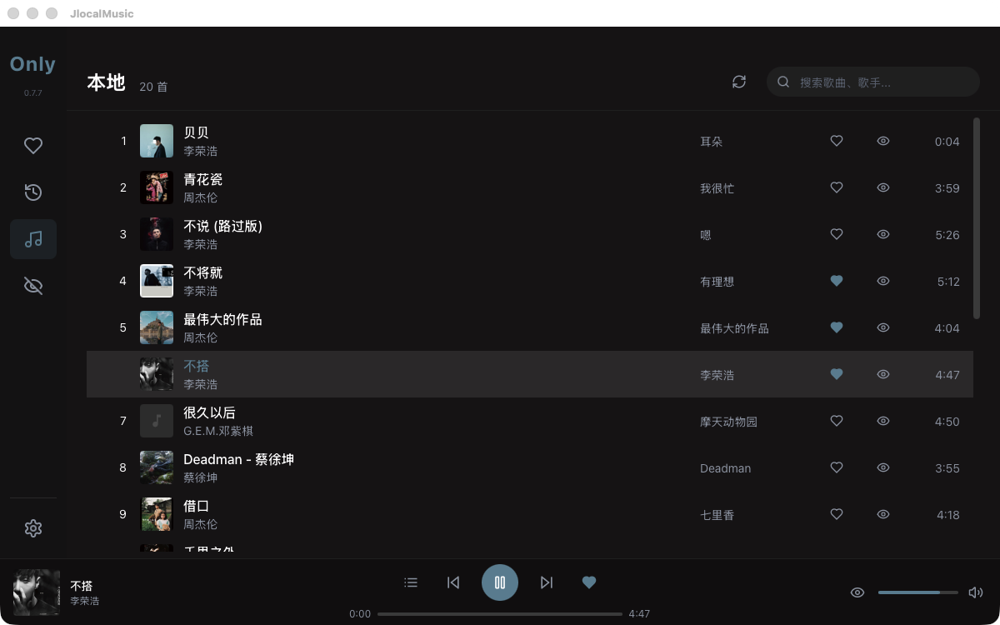

# JlocalMusic Music Player

[](https://opensource.org/licenses/MIT)
[](https://tauri.app)
[](https://react.dev)

A local music player built with Tauri 2 + React 19, focused on a clean and efficient local music management experience.



## ✨ Features

- 🚀 **Lightweight & Fast** - Built with Tauri 2, small bundle size, quick startup
- 🎵 **Wide Format Support** - MP3, FLAC, WAV, DSF, DFF, OGG, AAC, M4A and more
- 🎤 **Lyrics Support** - LRC lyrics files and embedded lyrics with auto-scroll
- 🎨 **Elegant UI** - Dark theme, dynamic background colors, smooth transition animations
- 🔒 **Privacy First** - All data stored locally
- 📁 **Smart Management** - Multi-folder support, auto-cleanup deleted songs

> 💡 Currently developed and tested on macOS Apple Silicon. Windows/Linux support coming soon.

## 🎼 Supported Formats

| Format | Extensions | Status |
|--------|------------|--------|
| MP3 | .mp3 | ✅ Full Support |
| FLAC | .flac | ✅ Full Support |
| WAV | .wav | ✅ Full Support |
| DSF/DSD | .dsf, .dff, .dsd | ✅ Full Support |
| OGG Vorbis | .ogg, .oga | ✅ Full Support |
| AAC/M4A | .aac, .m4a | ✅ Full Support |
| NCM | .ncm | ⚠️ Recognition only, auto-hidden |
| QMC | .qmc, .qmc0, .qmc3 | ⚠️ Recognition only, auto-hidden |

## 🛠️ Tech Stack

### Backend (Rust)
- **Tauri 2** - Cross-platform desktop framework
- **SQLite + sqlx** - Lightweight database
- **rodio + Symphonia** - Audio playback and decoding
- **lofty** - Audio metadata extraction
- **tokio** - Async runtime

### Frontend (React)
- **React 19** - UI library
- **TypeScript** - Type safety
- **Tailwind CSS** - Utility-first CSS
- **Zustand** - Lightweight state management
- **Lucide React** - Icon library

## 📦 Project Structure

```
Jlocal/
├── src/                    # Frontend code
│   ├── api/                # API wrappers
│   ├── components/         # Reusable components
│   ├── stores/             # State management (Zustand)
│   ├── views/              # Page views
│   └── hooks/              # Custom hooks
├── src-tauri/              # Backend code (Rust)
│   ├── src/
│   │   ├── commands/       # Tauri commands
│   │   ├── database.rs     # Database operations
│   │   ├── player.rs       # Audio player
│   │   ├── scanner.rs      # Folder scanning
│   │   └── metadata.rs     # Metadata extraction
│   └── icons/              # App icons
├── public/                 # Static assets
└── docs/                   # Documentation
```

## 🚀 Development

### Prerequisites
- Node.js 18+
- Rust 1.70+
- macOS (Apple Silicon)

### Local Setup

```bash
# Clone repository
git clone https://github.com/your-username/jlocal.git
cd jlocal

# Install dependencies
npm install

# Development mode
npm run tauri:dev

# Build
npm run tauri:build
```

### Common Commands

```bash
npm run dev          # Frontend development
npm run typecheck    # Type checking
npm test             # Run tests
npm run lint         # Linting
```

## 📝 Changelog

### v0.7.6 (Test Only)
> ⚠️ For testing GitHub upload process only, no feedback needed

- ✨ DSF/DFF/DSD format support: use Symphonia decoder for playback and duration
- 🔧 Scan optimization: auto-cleanup deleted songs
- 🐛 Fixed main/secondary folder management
- 🎨 Adjusted color transition time to 0.7s
- 🐛 Fixed database read-only issues

### v0.7.0
- ✨ Dynamic background colors: extract theme color from album cover
- ✨ Multi-folder support: main folder + secondary folders
- 🎨 Smooth transition animations
- 🐛 Fixed player core issues

### v0.6.5
- ✨ Lyrics display feature
- 📝 LRC lyrics file parsing support
- 🎵 Embedded lyrics extraction

### v0.6.4
- ✨ Lyrics view
- 🔧 Optimized hide/like logic
- 🎨 Improved sidebar and player bar UI

### v0.6.0
- 🎨 New UI design
- ❤️ Like/unlike songs support
- 📊 Multiple sort options

### v0.5.0
- 🔊 Player core refactor (Actor pattern)
- 📋 Playlist support
- 🔁 Loop mode support

### v0.4.0
- 🎵 rodio audio library
- 🔊 Volume control
- 🔀 Play mode switching

### v0.3.0
- 🚀 Migration to Tauri + Rust
- 🗄️ SQLite database introduction
- 🔍 Basic metadata extraction

### v0.2.0
- ❤️ Like functionality
- 📋 Playlist support
- 🎵 Basic metadata extraction

### v0.1.0
- 🎵 Basic music playback
- 📂 Local file scanning
- ⚠️ Based on Electron (later migrated to Tauri)

## 🛠️ Built With

This project uses the following open source libraries:

### Frontend
- [React](https://react.dev) - UI Framework (MIT)
- [TypeScript](https://www.typescriptlang.org) - Programming Language (Apache 2.0)
- [Tailwind CSS](https://tailwindcss.com) - CSS Framework (MIT)
- [Zustand](https://zustand-demo.pmnd.rs) - State Management (MIT)
- [Lucide React](https://lucide.dev) - Icons (ISC)
- [Vite](https://vitejs.dev) - Build Tool (MIT)
- [Vitest](https://vitest.dev) - Testing Framework (MIT)

### Backend
- [Tauri](https://tauri.app) - Desktop Framework (MIT/APACHE-2.0)
- [Rust](https://www.rust-lang.org) - Programming Language (MIT/APACHE-2.0)
- [rodio](https://docs.rs/rodio/) - Audio Playback (MIT)
- [Symphonia](https://github.com/pcherten/Symphonia) - Audio Decoding (MPL 2.0)
- [lofty](https://docs.rs/lofty/) - Audio Metadata (MIT)
- [sqlx](https://github.com/launchbadge/sqlx) - Database (MIT/APACHE-2.0)
- [tokio](https://tokio.rs) - Async Runtime (MIT)

## 🤝 Contributing

Issues and Pull Requests are welcome!

See [CONTRIBUTING.md](CONTRIBUTING.md) for details.

## 📄 License

[MIT License](LICENSE)

---

*Made with ❤️ using Tauri + React*
