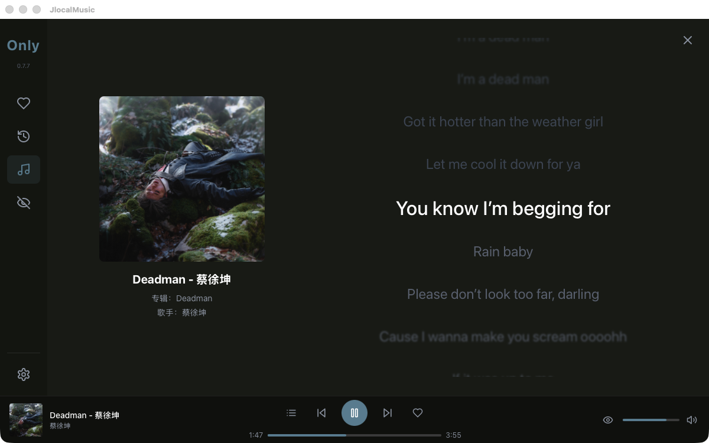
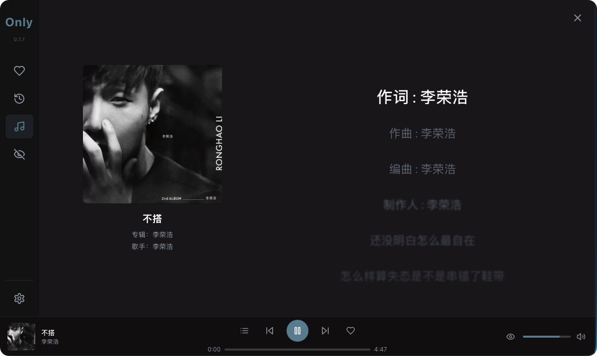

<div align="center">
  
  <h1>JlocalMusic Music Player</h1>
</div>

[](https://opensource.org/licenses/MIT)
[](https://tauri.app)
[](https://react.dev)

<div align="right">
  <a href="README-zh.md">🇨🇳 中文</a>
</div>

A local music player built with Tauri 2 + React 19, focused on a clean and efficient local music management experience.

<div align="center">
  <table>
    <tr>
      <td></td>
      <td></td>
      <td></td>
    </tr>
    <tr>
      <td align="center"><b>🎵 Main Interface</b></td>
      <td align="center"><b>🎛️ Player Controls</b></td>
      <td align="center"><b>🎤 Lyrics View</b></td>
    </tr>
  </table>
</div>

## ✨ Features

- 🚀 **Lightweight & Fast** - Built with Tauri 2, small bundle size, quick startup
- 🎵 **Wide Format Support** - MP3, FLAC, WAV, DSF, DFF, OGG, AAC, M4A and more
- 🎤 **Lyrics Support** - LRC lyrics files and embedded lyrics with auto-scroll
- 🎨 **Theme System** - 4 themes (Orange, Khaki, Gray Blue, Olive Green), dynamic background colors
- 🔒 **Privacy First** - All data stored locally
- 📁 **Smart Management** - Multi-folder support, auto-cleanup deleted songs
- ▶️ **Independent Play Queues** - Each view (Local/Liked/Hidden/History) has its own play queue

> 💡 Currently developed and tested on macOS Apple Silicon. Windows/Linux support coming soon.

## 🎼 Supported Formats

| Format | Extensions | Status |
|--------|------------|--------|
| MP3 | .mp3 | ✅ Full Support |
| FLAC | .flac | ✅ Full Support |
| WAV | .wav | ✅ Full Support |
| DSF/DSD | .dsf, .dff, .dsd | ✅ Full Support |
| OGG Vorbis | .ogg, .oga | ✅ Full Support |
| AAC/M4A | .aac, .m4a | ✅ Full Support |
| NCM | .ncm | ⚠️ Recognition only, auto-hidden |
| QMC | .qmc, .qmc0, .qmc3 | ⚠️ Recognition only, auto-hidden |

## 🛠️ Tech Stack

### Backend (Rust)
- **Tauri 2** - Cross-platform desktop framework
- **SQLite + sqlx** - Lightweight database
- **rodio + Symphonia** - Audio playback and decoding
- **lofty** - Audio metadata extraction
- **tokio** - Async runtime

### Frontend (React)
- **React 19** - UI library
- **TypeScript** - Type safety
- **Tailwind CSS** - Utility-first CSS
- **Zustand** - Lightweight state management
- **Lucide React** - Icon library
- **sonner** - Toast notifications
- **colorthief** - Album cover color extraction
- **react-hotkeys-hook** - Keyboard shortcuts
- **es-toolkit** - Debounce/throttle utilities

## 📦 Project Structure

```
Jlocal/
├── src/                    # Frontend code
│   ├── api/                # API wrappers
│   ├── components/         # Reusable components
│   ├── stores/             # State management (Zustand)
│   ├── views/              # Page views
│   └── hooks/              # Custom hooks
├── src-tauri/              # Backend code (Rust)
│   ├── src/
│   │   ├── commands/       # Tauri commands
│   │   ├── database.rs     # Database operations
│   │   ├── player.rs       # Audio player
│   │   ├── scanner.rs      # Folder scanning
│   │   └── metadata.rs     # Metadata extraction
│   └── icons/              # App icons
├── public/                 # Static assets
└── docs/                   # Documentation
```

## 🚀 Development

### Prerequisites
- Node.js 18+
- Rust 1.70+
- macOS (Apple Silicon)

### Local Setup

```bash
# Clone repository
git clone https://github.com/your-username/jlocal.git
cd jlocal

# Install dependencies
npm install

# Development mode
npm run tauri:dev

# Build
npm run tauri:build
```

### Common Commands

```bash
npm run dev          # Frontend development
npm run typecheck    # Type checking
npm test             # Run tests
npm run lint         # Linting
```

## 📝 Changelog

### v0.7.12 + patch (2026-05-10)
> 🔥 Code review release — 15 bugs fixed (3 P0 critical, 6 P1 important, 6 P2 quality) + 7 post-release fixes

**v0.7.12 (Original)**
- 🐛 **SongListHeader visible** — Removed `hidden` class, header columns now show
- 🐛 **Play history fix** — `finalizePlayHistory` now awaited properly
- 🛡️ **CSP security** — Replaced null CSP with restrict-to-self policy
- 🎨 **Album color** — colorthief Median Cut replaces single-pixel sampling
- ⚡ **Batch covers** — `useSongCovers` uses single RPC instead of N sequential calls
- 📦 **Type dedup** — `ViewType`/`PlayMode` unified under `types.ts`
- ⚙️ **Config dedup** — `PLAYER_CONFIG` merged, `progressInterval` fixed
- 🪟 **Resizable window** — min 900×600, no longer fixed 1200×750
- 🔧 **Rust path validation dedup** — removed duplicate in `settings.rs`
- 🧹 **Cleaned unused deps** — frontend `clsx`/`tailwind-merge`, Rust `config`/`regex`
- 🔧 **Type cast hack fixed** — `SortableItem` interface added `path` field
- 🔁 **HistoryView stable ref** — `loadPlayHistory` wrapped with `useCallback`
- ⏱️ **Volume debounce** — 100ms debounce reduces backend RPC frequency
- 🚀 **`getLikedSongs` SQL JOIN** — backend JOIN query replaces client-side filtering
- 🗑️ **Batch unlike** — `clear_liked_songs` RPC eliminates per-song loop

**v0.7.12-patch (Additional fixes)**
- 🐛 **Windows build** — `lto = true` → `lto = "thin"` for MSVC linker compatibility
- 🐛 **Player sink lifecycle** — `sink.take()` now properly stops sink on track completion
- 🐛 **`get_song_play_count` type fix** — `fetch_optional` + `?` replaces broken `unwrap_or(0)`
- 🎚️ **ProgressBar stale closure** — `displayTimeRef` keeps latest value for `handleMouseUp`
- 🔇 **`scan_folder` error handling** — explicit `match` replaces silent `unwrap_or((0,0))`
- ⚡ **Player CPU usage** — `recv_timeout(50ms)` → `100ms` reduces idle CPU
- 📝 **Blocking IO documented** — `get_duration_from_symphonia` sync I/O noted for future refactor

### v0.7.11
> 🔧 CI build fix + BUGS.md archive — 21 CODEX items compacted to summary

- 🔧 **CI fix** — npm install `--legacy-peer-deps` resolves peer dependency conflict in GitHub Actions
- 📝 **BUGS.md archived** — 21 fixed CODEX items compacted to summary table; full records in BUGS_HISTORY.md

### v0.7.10
> 🎯 CODEX Final Round — All P1 defects resolved, 3 review batches complete

- 🎯 **Sync format probe** — `probe_audio_file()` validates Symphonia/Rodio decodability before queueing
- 📁 **Startup persistence** — auto-scan writes `music_folder` to DB on first launch
- 🛡️ **Lyrics path protection** — proper errors for missing config and path violations
- 🖼️ **Cover cache COALESCE** — `upsert_songs` preserves existing cover on re-scan

### v0.7.9
> ⚡ Performance & code quality — 9 optimizations across Rust and React

- 🔧 **Log levels fixed** — 7 error scenarios in player.rs now use `warn!`/`error!` properly
- 🔇 **Scan log noise reduction** — per-song logs downgraded to `debug!`
- 📦 **Vec pre-allocation** — scanner vectors use `with_capacity` to reduce reallocs
- ⚛️ **useCallback memoization** — view switch handlers in App.tsx avoid Sidebar re-renders
- 🧹 **Inline arrow cleanup** — removed unnecessary wrapping in LocalView/LikedView
- 🏪 **useShallow selectors** — 5 components optimized to avoid cascade re-renders
- 💾 **Sort state persistence** — sessionStorage saves sort preferences across view switches
- 🎵 **DSD playback** — removed from unsupported list (Symphonia already handles it)
- 🧪 **142 tests, 11 files** — all passing, cargo check + tsc 0 errors

### v0.7.8
> 🎨 Theme system overhaul + 6 major refactoring replacements, ~216 lines removed

- 🎨 **Theme Aware UI** - All play buttons, badges, borders, filter tabs follow theme color
- ♻️ **Toast → sonner** - Deleted 3 files (-115 lines), replaced with 3.8M/week industry standard
- 🎨 **Color extraction → colorthief** - Median Cut quantization replaces single-pixel sampling
- 🎹 **Shortcuts → react-hotkeys-hook** - Scope support, deleted dead hook code
- 🛠️ **Debounce → es-toolkit** - 2x faster than lodash, treeshaken ~3kB
- 🔤 **Encoding → chardetng** - Firefox's detector handles all CJK encodings automatically
- 🔗 **Rust constants unified** - SYMPHONIA_EXTENSIONS shared across 3 files
- ▶️ **LikedView Play All** - One-click play entire liked playlist
- 🎯 **Independent queues** - Each view maintains its own play queue
- 🧪 **142 tests, 11 files** - All passing

### v0.7.7
> 🐛 Comprehensive bug fix release — 19 bugs fixed, -190 net lines

- 🐛 Smooth progress bar: eliminated dual-track update race causing visual time jumps
- ✨ Extended audio formats: added AIFF, Opus, CAF support, unified frontend/backend constants
- 🐛 Shuffle queue fix: `removeFromQueue` now searches by `path` instead of index
- 🐛 Enhanced error handling: eliminated empty catch blocks, unified to centralized error handler
- 🐛 Memory leak fix: timeout management properly cleaned up on unmount
- 🔧 Code quality: removed 305 lines of dead code, redundant methods cleaned
- 🔧 Naming: `SymphoniaFlacDecoder` → `SymphoniaDecoder`
- 🔧 Rust optimization: busy-wait thread → `recv_timeout`, `unwrap()` → `if let`
- 🔧 Field name fix: `LyricSource.source` → `type`

### v0.7.6 (Test Only)
> ⚠️ For testing GitHub upload process only, no feedback needed

- ✨ DSF/DFF/DSD format support: use Symphonia decoder for playback and duration
- 🔧 Scan optimization: auto-cleanup deleted songs
- 🐛 Fixed main/secondary folder management
- 🎨 Adjusted color transition time to 0.7s
- 🐛 Fixed database read-only issues

### v0.7.0
- ✨ Dynamic background colors: extract theme color from album cover
- ✨ Multi-folder support: main folder + secondary folders
- 🎨 Smooth transition animations
- 🐛 Fixed player core issues

### v0.6.5
- ✨ Lyrics display feature
- 📝 LRC lyrics file parsing support
- 🎵 Embedded lyrics extraction

### v0.6.4
- ✨ Lyrics view
- 🔧 Optimized hide/like logic
- 🎨 Improved sidebar and player bar UI

### v0.6.0
- 🎨 New UI design
- ❤️ Like/unlike songs support
- 📊 Multiple sort options

### v0.5.0
- 🔊 Player core refactor (Actor pattern)
- 📋 Playlist support
- 🔁 Loop mode support

### v0.4.0
- 🎵 rodio audio library
- 🔊 Volume control
- 🔀 Play mode switching

### v0.3.0
- 🚀 Migration to Tauri + Rust
- 🗄️ SQLite database introduction
- 🔍 Basic metadata extraction

### v0.2.0
- ❤️ Like functionality
- 📋 Playlist support
- 🎵 Basic metadata extraction

### v0.1.0
- 🎵 Basic music playback
- 📂 Local file scanning
- ⚠️ Based on Electron (later migrated to Tauri)

## 🛠️ Built With

This project uses the following open source libraries:

### Frontend
- [React](https://react.dev) - UI Framework (MIT)
- [TypeScript](https://www.typescriptlang.org) - Programming Language (Apache 2.0)
- [Tailwind CSS](https://tailwindcss.com) - CSS Framework (MIT)
- [Zustand](https://zustand-demo.pmnd.rs) - State Management (MIT)
- [Lucide React](https://lucide.dev) - Icons (ISC)
- [sonner](https://sonner.emilkowal.ski) - Toast Notifications (MIT)
- [colorthief](https://github.com/lokesh/color-thief) - Color Extraction (MIT)
- [react-hotkeys-hook](https://github.com/JohannesKlauss/react-hotkeys-hook) - Keyboard Shortcuts (MIT)
- [es-toolkit](https://es-toolkit.slash.page) - Utilities (MIT)
- [Vite](https://vitejs.dev) - Build Tool (MIT)
- [Vitest](https://vitest.dev) - Testing Framework (MIT)

### Backend
- [Tauri](https://tauri.app) - Desktop Framework (MIT/APACHE-2.0)
- [Rust](https://www.rust-lang.org) - Programming Language (MIT/APACHE-2.0)
- [rodio](https://docs.rs/rodio/) - Audio Playback (MIT)
- [Symphonia](https://github.com/pcherten/Symphonia) - Audio Decoding (MPL 2.0)
- [lofty](https://docs.rs/lofty/) - Audio Metadata (MIT)
- [sqlx](https://github.com/launchbadge/sqlx) - Database (MIT/APACHE-2.0)
- [tokio](https://tokio.rs) - Async Runtime (MIT)
- [chardetng](https://docs.rs/chardetng) - Encoding Detection (MIT/APACHE-2.0)

## 🤝 Contributing

Issues and Pull Requests are welcome!

See [CONTRIBUTING.md](CONTRIBUTING.md) for details.

## 📄 License

[MIT License](LICENSE)

---

*Made with ❤️ using Tauri + React*
